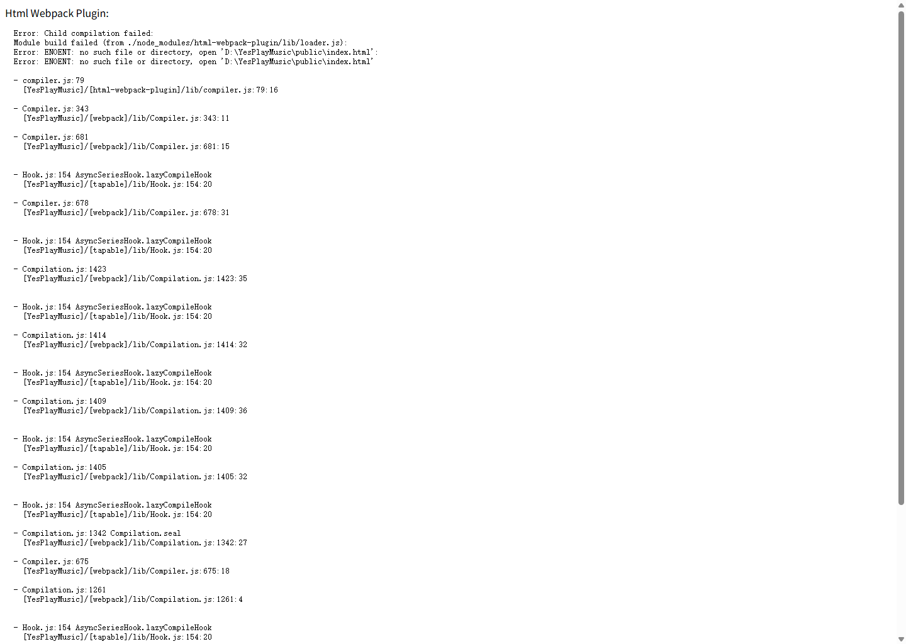
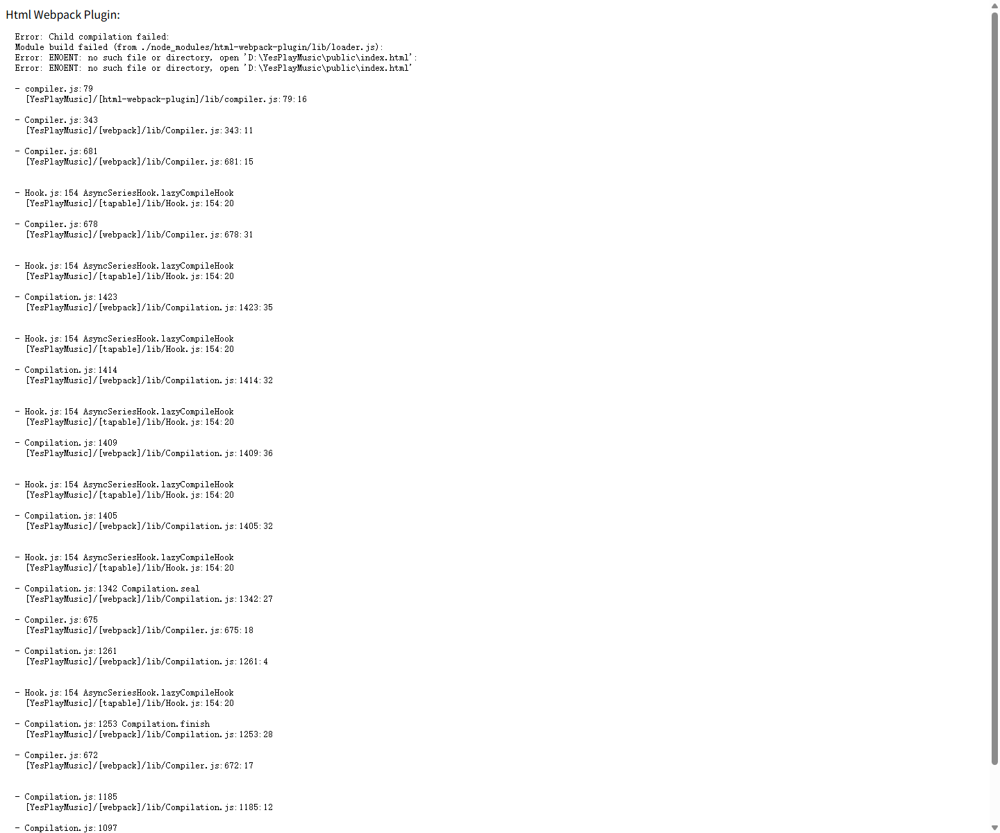
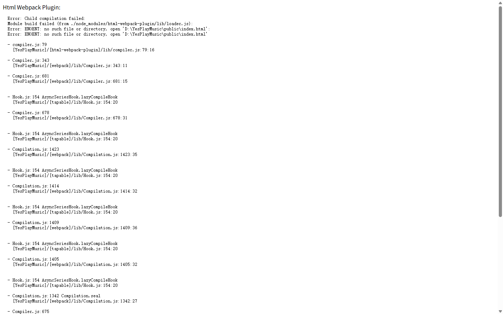

# CloudSound

CloudSound 是基于 [qier222/YesPlayMusic](https://github.com/qier222/YesPlayMusic) 的二次开发项目，当前阶段重点放在 Web 端播放器体验增强、播放器能力补强，以及项目文档与演示能力整理。

本仓库保留了原项目的 `MIT License`，并明确标注了上游来源与二次开发内容。

## 上游项目说明

- 上游项目：[qier222/YesPlayMusic](https://github.com/qier222/YesPlayMusic)
- 原始许可证：`MIT`
- 原始版权声明：`Copyright (c) 2020-2023 qier222`

## 本次二开已稳定完成的内容

这次版本主要整理并落地了 3 组可以稳定展示的 PC 端功能增强。

### 1. 缓存管理增强

- 重做了设置页缓存面板的展示方式
- 增加缓存总览统计
- 增加按分类查看缓存占用
- 支持按分类清理缓存
- 支持刷新缓存统计
- 清缓存时不再误伤本地听歌统计数据

主要涉及：

- `src/views/settings.vue`
- `src/utils/db.js`

### 2. 本地播放历史与听歌统计

- 新增本地播放事件记录
- 新增本地播放历史摘要
- 新增总听歌时长、总播放次数、总歌曲数统计
- 新增最近播放歌曲列表
- 支持本地历史 / 云端历史切换
- 支持清空本地历史

主要涉及：

- `src/utils/Player.js`
- `src/utils/db.js`
- `src/store/actions.js`
- `src/store/state.js`
- `src/views/library.vue`

### 3. 均衡器与音质入口内嵌播放器

- 将音质切换入口从设置页移动到播放器中
- 在播放器中加入均衡器入口
- 提供均衡器开关、预设、10 段手动调节、重置能力
- 均衡器不只是 UI，而是真正接入 Web Audio 播放链路

主要涉及：

- `src/components/Player.vue`
- `src/utils/Player.js`
- `src/store/initLocalStorage.js`

## 功能展示

以下截图均为当前版本实际运行时生成的 PC 端功能展示图。

### 缓存管理增强



### 本地播放历史与统计



### 播放器均衡器与音质入口



## 当前阶段说明

我们已经尝试推进手机 / iPad 端适配，但这一轮结果还不够稳定，因此当前 README 不再把移动端适配作为“已完成成果”展示。后续会继续单独打磨这一部分。

## 本地开发

### 环境要求

- Node.js：`14.x` 或 `16.x`
- 包管理器：`yarn`

### 安装依赖

```bash
yarn install
```

### 启动前端

```bash
yarn serve
```

### 构建

```bash
yarn build
```

## 附加文档

- 本地部署记录：[LOCAL_SETUP_REPORT.md](LOCAL_SETUP_REPORT.md)
- 今日开发技术博客：[docs/2026-06-26-cloudsound-devlog.md](docs/2026-06-26-cloudsound-devlog.md)
- 开源来源与致谢说明：[docs/OPEN_SOURCE_ATTRIBUTION.md](docs/OPEN_SOURCE_ATTRIBUTION.md)

## 开源说明

本项目是基于 YesPlayMusic 的二次开发版本。

- 保留上游 MIT License
- 保留原作者版权声明
- 在仓库中明确标注上游来源

许可证全文见：

- [LICENSE](LICENSE)
